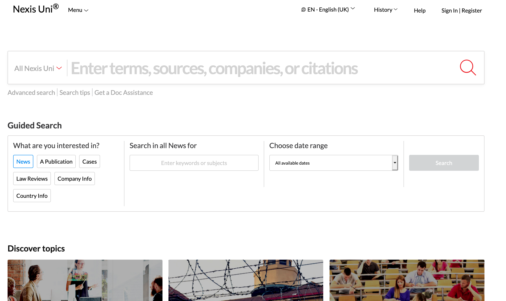

```{r setup, include=FALSE}
options(htmltools.dir.version = FALSE)
knitr::opts_chunk$set(fig.retina = 3)
```

```{r xaringan-themer, include=FALSE, warning=TRUE}
library(xaringanthemer)
style_mono_accent(
  base_color = "#0089CF",
  base_font_size = "22px",
  title_slide_background_image = "img/lost-at-sea.png",
  title_slide_background_size = "cover",
  title_slide_background_position = "right",
  text_bold_color = "var(--text-color)",
  extra_css = list(
    ".title-slide h1, h2, h3" = list(
      "text-align" = "left",
      "vertical-align" = "top",
      "text-transform" = "capitalize"
    ),
    ".title-slide h1" = list(
      "margin-top" = "-110px"
    ),
    ".remark-slide-number" = list(
      "display" = "none"
    ),
    ".card.list" = list(
      "position" = "relative",
      "left" = "20%",
      "box-shadow" = "0 4px 8px 1px rgba(0,0,0,0.1)",
      "border-radius" = "4px",
      "width" = "60%",
      "margin-bottom" = "15px"
    ),
    ".card.switch" = list(
      "box-shadow" = "0 4px 8px 1px rgba(0,0,0,0.1)",
      "border-radius" = "4px",
      "width" = "60%",
      "float" = "left",
      "margin-bottom" = "15px"
    ),
    ".card.small" = list(
      "position" = "absolute",
      "box-shadow" = "0 4px 8px 1px rgba(0,0,0,0.1)",
      "border-radius" = "4px",
      "margin" = "15px",
      "padding" = "5px",
      "background-color" = "rgba(0, 137, 207, 0.1)"
    ),
    ".card h2" = list(
      "color" = "white",
      "background-color" = "rgba(0, 137, 207, 0.4)",
      "font-size" = "1.2rem",
      "padding" = "5px",
      "margin-top" = "0",
      "margin-bottom" = "4px",
      "border-radius" = "4px 4px 0 0"
    ),
    ".card.switch ul, div.card ol" = list(
      "margin-bottom" = "4px",
      "padding-bottom" = "15px"
    ),
    ".card p" = list(
      "margin" = "10px"
    ),
    ".card.switch.right" = list(
      "float" = "right",
      "text-align" = "left"
    )
    # "div.card-switch ~ div.card1" = list(
    #   "margin-top" = "0"
    # )
  )
)
```
class:inverse
# Where can you find information?

---
# Where can you find information?
<span class="card small" style="top:28%;left:10%">Personal blogs, vlogs, etc</span>
<span class="card small" style="top:35%;left:10%">Company websites</span>
<span class="card small" style="top:48%;left:10%">(Inter)national organisations</span>
<span class="card small" style="top:61%;left:10%">Newspapers & magazines</span>
<span class="card small" style="top:71%;left:10%">Your friends after a night on the town</span>
<span class="card small" style="top:88%;left:10%">Wikipedia</span>
<span class="card small" style="top:28%;left:55%">Political parties</span>
<span class="card small" style="top:35%;left:55%">Social media</span>
<span class="card small" style="top:61%;left:55%">Documentaries</span>
<span class="card small" style="top:88%;left:55%">Academic studies</span>

---

# Aspects of information

<div class="card list" style="margin-top:100px;margin-bottom:50px;">
<h2>Time versus trust</h2>
<p>How difficult is it to check the information?</p>
</div>

<div class="card list">
<h2>Objectives</h2>
<p>Why was the information provided?</p>
</div>

---

# Where can you find information?

<div class="card list" style="position:relative;top:10%;">
<h2>Search broadly</h2>
<p>No need to limit yourself to academic studies</p>
<p>Different sources can answer different kinds of questions</p>
<p>Be aware of your information source and its limits.</p>
</div>
 
---

# Where can you find information?

<div class="card switch">
<h2>Interesting topics & relevant discussions</h2>
<p>
Social media (Twitter)</br>
Newspapers & magazines
</p>
</div>

<div class="card switch right">
<h2>Opinions & points of view</h2>
<p>NGOs, political organizations, companies</p>
</div>

<div class="card switch">
<h2>Background info</h2>
<p>Wikipedia</br>
Textbooks, handbooks</p>
</div>

<div class="card switch right">
<h2>Detailed analysis, &ldquo;proof&rdquo;</h2>
<p>Academic books/articles</p>
</div>
---

class:inverse
# Finding information<br>from different sources

---

# Finding information<br>from different sources
<div class="card list">
<h2>We will discuss:</h2>
<p>
Newspapers & magazines<br>
Academic articles<br>
Academic books<br>
</p>
</div>
---

# Access to information
<div class="card list" style="margin-top:80px;margin-bottom:50px;">
<h2>On campus</h2>
<p>
Should have access automatically<br>
If not: Log on to VUnet<br>
But: no one is on campus...
</p>
</div>

<div class="card list">
<h2>Off campus</h2>
<p>
Log on to VUnet<br>
Search materials using <a href="#libsearch">Libsearch</a><br>
See <a href="https://ub.vu.nl/en/search-help/off-campus-access/index.aspx" target=_blank>this information</a>.    
</p>
</div>

---

# Finding information in<br/>magazines & newspapers

- browse
- title website
- Nexis Uni

---
name:nexis

# Nexis Uni


--

---
 <iframe width="420" height="315"
src="https://www.youtube.com/embed/YiT94DEAcw0?controls=0">
</iframe> 

---

# Finding academic publications
- Google
- Libsearch
- Scopus

---
name:google

# Google Scholar

pro and con

---
name:libsearch

# VU Libsearch

pro and con

---

# Scopus

- pro and con
- more detail

---

class:inverse
# How to search 

---

# How to search: &ldquo;building blocks&rdquo;
## Boolean operators
## Other operators

---

# How to search: &ldquo;snowball&rdquo;

---
# A suggested workflow

.center[
<svg
  version="1.1"
  baseProfile="full"
  viewbox="0 0 410 230" width="80%"
  xmlns="http://www.w3.org/2000/svg"
  preserveAspectRatio="xMinYMin">

  <defs>
    <!-- arrowhead marker definition -->
    <marker id="arrow" viewBox="0 0 10 10" refX="0" refY="5"
      markerWidth="5" markerHeight="5"
      orient="auto-start-reverse">
    <path d="M 0 0 L 10 5 L 0 10 z" stroke="black" stroke-width="1" fill="black"/>
    </marker>

  </defs>
  <title>Workflow</title>

<!-- # 1. Topic Search -->
  <rect x="5" y="5" width="100" height="20" rx="4" ry="4" fill="none" stroke="#000000" />
  <text dominant-baseline="central" font-size="11px" fill="black">
    <tspan x="10" y="14.5">Topic search</tspan>
  </text>

<!-- 2. Select, scan, & select again -->
  <rect x="65" y="40" width="100" height="30" rx="4" ry="4" fill="none" stroke="#000000" />
  <text dominant-baseline="central" font-size="11px" fill="black">
    <tspan x="70" y="47.25" >Select, scan, and </tspan>
    <tspan x="70" dy="14.5">select again</tspan>
  </text>

<!-- 3. Snowball search -->
  <rect x="125" y="85" width="100" height="20" rx="4" ry="4" fill="none" stroke="#000000" />
  <text dominant-baseline="central" font-size="11px" fill="black">
    <tspan x="130" y="94.5">Snowball search</tspan>
  </text>

<!-- 4. Select -->
  <rect x="185" y="125" width="100" height="20" rx="4" ry="4" fill="none" stroke="#000000" />
  <text dominant-baseline="central" font-size="11px" fill="black">
    <tspan x="190" y="134.5">Select</tspan>
  </text>

<!-- 5. Read and select -->
  <rect x="245" y="165" width="100" height="20" rx="4" ry="4" fill="none" stroke="#000000" />
  <text dominant-baseline="central" font-size="11px" fill="black">
    <tspan x="250" y="174.5">Read and select</tspan>
  </text>

<!-- 6. Reference -->
  <rect x="305" y="205" width="100" height="20" rx="4" ry="4" fill="none" stroke="#000000" />
  <text dominant-baseline="central" font-size="11px" fill="black">
    <tspan x="310" y="214.5">Reference</tspan>
  </text>

<!-- Arrows -->
<!-- Down -->
  <path d="M 30 30 Q 20 55 55 55" stroke="black" fill="none" marker-end="url(#arrow)"/>
  <path d="M 90 75 Q 80 95 115 95" stroke="black" fill="none" marker-end="url(#arrow)"/>
  <path d="M 150 110 Q 140 135 175 135" stroke="black" fill="none" marker-end="url(#arrow)"/>
  <path d="M 210 150 Q 200 175 235 175" stroke="black" fill="none" marker-end="url(#arrow)"/>
  <path d="M 270 190 Q 260 215 295 215" stroke="black" fill="none" marker-end="url(#arrow)"/>

<!-- Up -->
  <path d="M 140 35 Q 145 15 120 15" stroke="black" fill="none" stroke-dasharray="5,3" />
  <path d="M 320 160 Q 330 95 235 95" stroke="black" fill="none" stroke-dasharray="5,3" marker-end="url(#arrow)"/>
  <path d="M 320 160 Q 355 5 120 15" stroke="black" fill="none" stroke-dasharray="5,3" marker-end="url(#arrow)"/>

</svg>
]
---
# Finding information:<br/>Tips & tricks
**Not a linear process:**
Adjust your search terms as needed
You will need more than 15 minutes (but in the long term...)

**Make a logbook!**
Keep track of your searches

**Each search engine differs slightly**
Check the manuals

**&ldquo;[Good artists copy; great artists steal](https://quoteinvestigator.com/2013/03/06/artists-steal/)&rdquo;**
Good academics steal and leave fingerprints

---
# Finding information: more support
**ub.vu.nl**
Information, opening hours, news

**Online guides**
For more tips & tricks 

**Events & workshops**
Finding literature and data, reference software, ...

**vraag.ub@vu.nl**
For questions on access, availability


